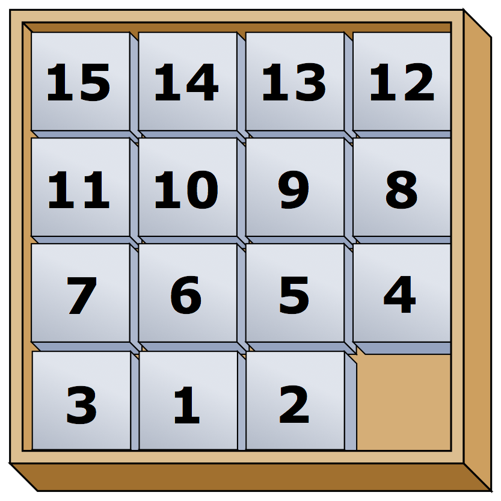

# fifteen.py

{: style="width:40%"}

In deze opdracht ga je de fifteen opdracht van CS50 maken in Python. Er wordt integenstelling tot CS50 geen code aangeleverd, je moet alles zelf schrijven.

## Gebruik

	python fifteen.py
	Usage: python fifteen.py size

	python fifteen.py hello
	Usage: python fifteen.py size

	python fifteen.py 10
	Usage: python fifteen.py size

	python fifteen.py 4
	15 14 13 12
	11 10 9  8
	7  6  5  4
	3  1  2  _
	Tile to move: 2

	python fifteen.py 3
	8  7  6
	5  4  3
	2  1  _
	Tile to move:

## Voorbeeld spelverloop

	python fifteen.py 3
	8  7  6
	5  4  3
	2  1  _
	Tile to move: 1

	8  7  6
	5  4  3
	2  _  1
	Tile to move: 7
	Tile to move: 4

	8  7  6
	5  _  3
	2  4  1
	Tile to move:

## Specificatie

* Schrijf een programma genaamd `fifteen.py` dat je aanroept met één integer command line argument, de grootte van het bord.
* Worden er meer of minder commandline argumenten gegeven, dan moet het programma een bericht printen en stoppen.
* Is het command line argument geen integer, dan moet het programma een bericht printen en stoppen.
* Is het command line argument groter dan 9 of kleiner dan 0, dan moet het programma een bericht printen en stoppen.
* Laat de gebruiker het spel fifteen spelen, op dezelfde manier als de CS50 fifteen.
* Elke ronde kan de gebruiker een getal invullen om te wisselen met het lege vakje. Ligt dit vakje niet naast het lege vakje, dan print je een bericht en geef je de gebruiker een nieuwe kans.
* Zodra de winnende bord situatie is bereikt, dat is in optellende volgorde met het lege vakje als laatste vakje, print je een felicitatie en stopt jouw programma.
* Na elke zet print je de bord situatie naar de gebruiker.
* Je mag aannemen dat de gebruiker enkel integers invult als zet.
* Je mag de bordsituaties onder elkaar printen. Je hoeft er niet voor te zorgen dat het scherm leeg is voordat je de nieuwe situatie print, zoals dit wel het geval was in de CS50 opdracht.

## Tips

* Schrijf functies! Spiek ook even bij jouw ingeleverde fifteen.c opdracht.
* Bouw het programma in stapjes op, en lees de specificatie goed!

## Testen

Er is geen checkpy voor deze opdracht, je zult het zelf met de hand moeten testen!
