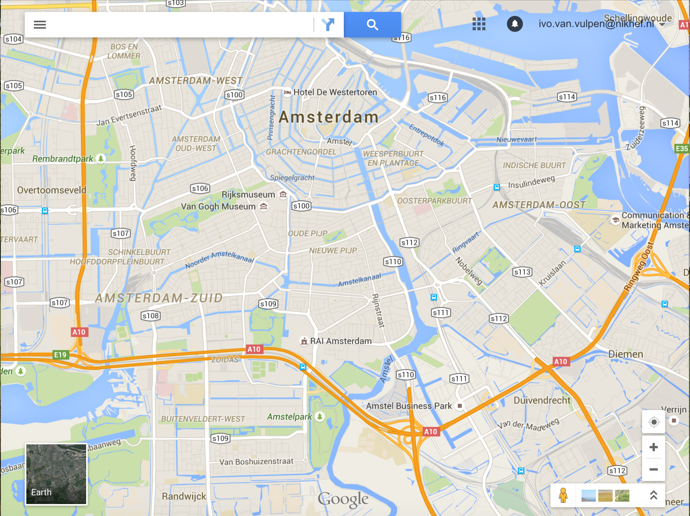
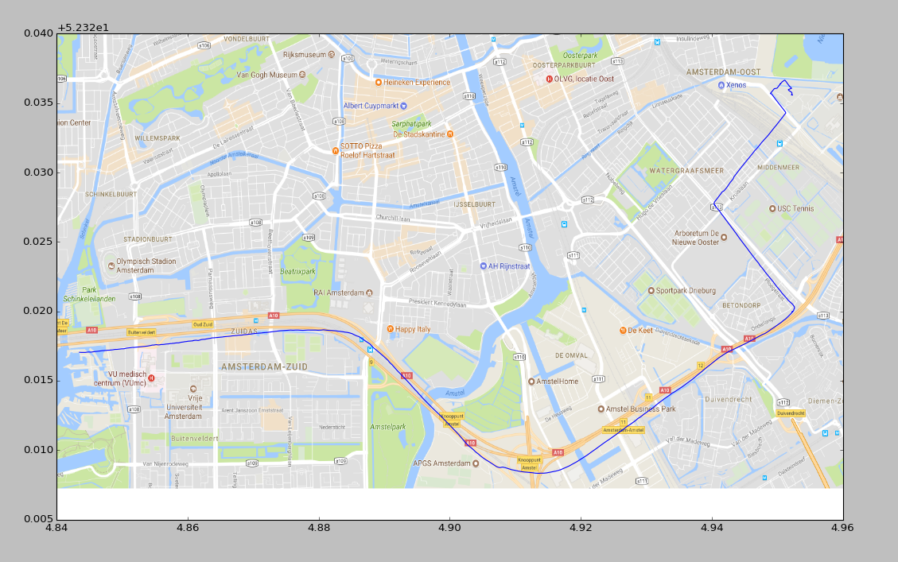

# Autorit

Een mobiele telefoon bevat veel delicate sensoren die informatie verzamelen over de positie, snelheid, versnelling. Een stel natuurkundigen hebben gedurende een korte auto-rit de data opgeslagen en in een file weggeschreven met een frequentie van 1[Hz]. Het verzamelen van de data begon toen de auto zich bevond op de plek waar de snelweg A4 op de ringweg A10 aansluit. Het verzamelen van de data stopte toen de auto op het Nikhef was aangekomen.

## Opdracht 1: Autorit analyseren

We gaan de data van de rit analyseren, en visueel maken door deze over een map van amsterdam te leggen. Zo kan je precies zien waar de auto heeft gereden. Ook gaan we onderzoeken waar de auto meer dan 50 km/uur heeft gereden.

De sensordata is beschikbaar in het bestand `autorit.data` en is te downloaden  via de volgende link:

<!--<DATA DOWNLOAD LINK>-->

### Tussenstap 1: preprocessing

Helaas steekt het data bestand op een orginele, niet standaard manier in elkaar. Dat betekent dat we niet direct gebruik kunnen maken van modules om data in te lezen en te verwerken. We zullen eerst een beetje moeten preprocessen, de data zo wegschrijven dat we er makkelijk mee kunnen werken.

Het data bestand begint met de namen van de 36 kolommen, elk op één regel. Dan zijn er 761 datapunten met elke 36 waardes. Deze datapunten staan elk op twee regels, gevolgd door een witregel. De waardes zijn gescheiden door een `;`. Open het bestand maar eens met een tekst editor om een beeld te krijgen van het formaat.

We willen dit in het `.csv` (Comma,Seperated,Values) formaat krijgen. Dat is een fijn formaat voor o.a. Excel, maar ook voor de module pandas die we zo gaan gebruiken. De naam zegt het al, alle waardes in dit formaat zijn gescheiden door een komma. De eerste regel van het nieuwe `.csv` bestand, genaamd `autorit.csv`, moet bestaan uit alle kolomnamen, gescheiden door een komma. De volgende 761 regels moeten alle datapunten zijn, elk op één regel, waar alle waardes gescheiden zijn door een komma.

Schrijf een script (code) genaamd `preprocess.py` dat `autorit.data` omzet naar `autorit.csv`. Houd het simpel, en kijk goed naar de uitkomst.

### Tussenstap 2: pandas intro

Nu we `autorit.csv` hebben kunnen we gebruik maken van bestaande modules om de data in te lezen en te verwerken. Scheelt een hoop werk! Wij gaan werken met **pandas**, een populaire dataverwerking module voor Python. In tegenstelling tot alle modules tot nu toe, wordt pandas niet meegeleverd met Python. We zullen deze moeten downloaden en installeren. Geen paniek! Python modules zijn tegenwoordig makkelijk te downloaden en installeren, namelijk door middel van **pip** (Pip Installs Python). Het enige wat we hoeven te doen om pandas te installeren is de volgende regel uit te voeren in de terminal:

    python -m pip install pandas

Bovenstaande regel voert Python uit, en vertelt Python om de module pip uit te voeren d.m.v. de `-m` (module) flag. Dan wordt aan pip de argumenten `install` en `pandas` meegegeven, wat pip pandas laat installeren. Dat is alles, je hebt nu de module pandas tot je beschikking!

Laten we beginnen met een voorbeeld. Maak een bestand `auto.py` en zet daarin de volgende code:

    import pandas as pd
    import matplotlib.pyplot as plt

    # read data
    data = pd.read_csv("autodata.csv")

    # plot long and lat data
    plt.plot(data["long"], data["lat"])

    # show plot
    plt.show()

Deze code begint met pandas te importeren door middel van `import pandas as pd`. We kunnen nu `autorit.csv` inladen d.m.v. `data = pd.read_csv("autorit.csv")`. De functie `read_csv` van pandas creeërt een `Dataframe`. Dat is een datastructuur van pandas waar we straks heel makkelijk berekeningen mee kunnen doen, en waardes uit kunnen halen. Zo kun je kolommen uit dit `Dataframe` ophalen als volgt: `data["speed"]`. Vervolgens kun je individuele waardes ophalen als volgt: `data["speed"][0]`. Ook kun je bepaalde berekeningen in één keer loslaten op een hele serie aan data, bijvoorbeeld: `data["speed"].mean()` geeft je de gemiddelde snelheid (in m/s want `autorit.data` is van natuurkundigen ;). Behalve al dit kunnen we ook gemakkelijk dingen plotten met `matplotlib`. Run `auto.py` maar eens, je ziet dan de gereden route. Om het wat interessanter te maken kunnen we ook een kaart van Amsterdam als achtergrond gebruiken. Om je een hoop zoek erk te besparen hebben we dat alvast voor je gedaan met de code hieronder:

    import pandas as pd
    import matplotlib.pyplot as plt

    # read data
    data = pd.read_csv("autodata.csv")

    # create figure
    fig = plt.figure()

    # create subplot
    ax = fig.add_subplot(111)

    # plot long and lat data
    ax.plot(data["long"], data["lat"], zorder = 1)

    # set background img
    x0, x1 = ax.get_xlim()
    y0, y1 = ax.get_ylim()
    img = plt.imread("kaart.png")
    ax.imshow(img, extent = [x0, x1, y0, y1], aspect = "auto", zorder = 0)

    # show plot
    plt.show()

De code ziet er al meteen wat ingewikkelder uit, maar het is niks meer dan een plaatje toevoegen op de achtergrond. Enkel gebruiken we nu een subplot, en de grootte van deze subplot om het plaatje te schalen. Verwijder de oude code, en copy-paste bovenstaande code in `auto.py`, en run het nogmaals. Je ziet dan als het goed is het volgende plaatje:

### Tussenstap 3: afgelegde afstand

Schrijf een script `afstand.py` dat op de eerste regel uitprint wat de geschatte afgelegde afstand in kilometers van de auto is. Gebruik hiervoor de snelheid op elke tijdstap, en neem aan dat er één meetpunt per seconde is gedaan (we negeren de kleine schommelingen even).

### Tussenstap 4: sneller dan 50 km/u

Schrijf een script `auto.py` dat de afgelegde route van de auto laat zien. Kleur de stukken waar de auto 50 km/u of sneller rijdt rood, en de stukken waar de auto langzamer dan 50km/u rijdt blauw. Print op de eerste regel uit hoeveel seconden de auto sneller heeft gereden dan 50 km/u. Let op, de snelheid in `autorit.csv` is in m/s.

Om de lijnen te kleuren is het het makkelijkst om meerdere kleine lijn segmenten te plotten. Ga door de data heen, en verzamel telkens de longitude en latitude data in bijvoorbeeld een lijst. Doe dit totdat de snelheid ineens onder of boven de 50 km/u komt. Plot vervolgens de verzamelde longitudes en latitudes d.m.v. `ax.plot(longitudes, latitudes, zorder=1, color="red")`, of `color="blue"` voor een blauwe lijn.

## Testen

    checkpy preprocess
    checkpy afstand
    checkpy auto

<!--
Bovenin de file staat kort welke informatie elk veld bevat. Dit is typisch hoe je een databestand binnen krijgt: in een formaat dat snel automatisch te lezen is, maar soms ontbreken duidelijke omschrijvingen van wat het nu precies allemaal is. Toch moet je wel aardig kunnen afleiden wat je er mee kunt. (Probeer dus ook eerst zelf wijs te worden uit het bestand voordat je met anderen in discussie gaat hierover. Goede oefening!)
-->
