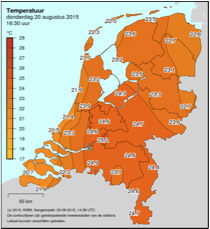

# Klimaat

{:.inline}

Laten we een steentje bijdragen aan de klimaatdiscussie en data analyseren die door de ECA (European Climate Assessment) [beschikbaar](http://eca.knmi.nl/dailydata/predefinedseries.php) wordt gemaakt in grote data files. We beperken ons tot data die de maximum- en minimumtemperatuur beschrijft voor elke dag in De Bilt sinds 1901.

Bestanden:

- <http://www.nikhef.nl/~ivov/Python/KlimaatData/DeBiltTempMax.txt>
- <http://www.nikhef.nl/~ivov/Python/KlimaatData/DeBiltTempMin.txt>

Download de bestanden, open ze en lees bovenin hoe de data gecodeerd is. We zien dat de maximum(minimum)-temperatuur op 1 januari 1901 -3.1(-6.8) graden Celsius was.

## Opdracht 2

We gaan de twee data bestanden analyseren en op basis van de data een aantal vragen beantwoorden. Dit alles gaan we presenteren in een Jupyter Notebook.

### Tussenstap 1: Jupyter Notebook intro
**Jupyter notebook** is een handige tool voor het creeëren van verslagen met 'live' code. Zie ook wat marketing van jupyter.org:
"*The Jupyter Notebook is an open-source web application that allows you to create and share documents that contain live code, equations, visualizations and explanatory text. Uses include: data cleaning and transformation, numerical simulation, statistical modeling, machine learning and much more.*". Om deze redenen is dit een steeds populairder wordende tool. Naar verwachting zul je dit ook nog een aantal keer bij andere vakken tegenkomen en gebruiken. Daarom gaan we Jupyter Notebook introduceren in deze opdracht.

Eerst zul je de notebook moeten installeren. Ook dit kunnen we weer doen dankzij pip. Voer simpelweg het volgende commando in de terminal:

    python -m pip install jupyter

Heb even geduld na het uitvoeren hiervan. Zodra alles geïnstalleerd is, kun je Jupyter Notebook starten door het volgende commando in de terminal in te voeren:

    jupyter notebook

Je ziet nu een nieuwe webpagina openen. Er zijn drie tabjes: `Files`, `Running`, en `Clusters`. We hebben nu enkel de eerste nodig. Navigeer binnen `Files` naar een plek waar je jouw werk wilt opslaan. Dit zijn simpelweg de mappen op jouw computer, dus je kan altijd een nieuwe map aanmaken voor jouw werk. Zodra je bent aangekomen, klik je rechtsboven op het dropdown-menu `new`. Kies hier voor een Python 3 notebook. Dan opent er een nieuw tabblad met daarin een nieuwe notebook.

Voor we beginnen, ga linksboven naar het dropdown-menu `file` en klik `rename`. Noem je nieuwe notebook: `klimaat`. In jouw notebook heb je zogenaamde cells. Dat zijn vakken waar je zowel code als tekst kan schrijven. Aangezien we een Python 3 notebook hebben, kunnen we Python code schrijven. Probeer maar eens: `print(3 * 4)`. Voer je dit in de cell, en druk je vervolgens op shift+enter (zo run je een cell), dan zie je direct onder de cell de uitkomst! Druk je enkel op enter, dan krijg je een extra regel binnen de cell.

Nieuwe cells kun je aanmaken met de knoppen bovenin het scherm, en je kan ze ook verplaatsen. Uitkomsten van cells zijn beschikbaar in andere cells, zo kun je verder werken met eerdere berekeningen. Let wel, cells updaten niet automatisch als je een andere cell runt. Je zal de cells of handmatig opnieuw moeten runnen of meerdere tegelijk via het dropdown menu `Cell`.

Je hebt binnen jouw Python 3 notebook toegang tot je gehele Python 3 installatie. Dus ook de modules die je hebt geïnstalleerd zoals `matplotlib` en `pandas`. Vergeet ze niet te importeren, net zoals je normaal ook zou doen. Maak eens een cell aan, plak daarin de volgende code, en druk op shift+enter.

    import matplotlib.pyplot as plt
    plt.plot(range(10))
    plt.show()

Zo heb je meteen de grafiek onder jouw code! (Maakt het nakijken ook een stuk makkelijker ;)

Behalve code, kunnen we ook tekst schrijven. Dit gaat in Markdown. Dat is een simpel mark-up taaltje (vandaar ook de naam). Zo kun je kopjes aanmaken met hekjes. Bijvoorbeeld `# Klimaat` creeërt een grote kop met de tekst Klimaat. Voeg je meer hekjes toe, dan krijg je een steeds kleiner kopje. Er zijn meer dingen die je kan doen, zoals links toevoegen, dikgedrukte tekst etc. Little fun fact, alle tekst op deze website is geschreven in Markdown! Wil je meer weten over Markdown, google even!

### Tussenstap 2: preprocessing

### Tussenstap 3: Extremen
Maak een bestand `temperatuur.py`. Wat waren de hoogste en laagste temperatuur die in De Bilt zijn gemeten sinds het begin van de 20e eeuw? Op welke dagen was dat? Zorg dat je programma de datum netjes op het scherm print. Zeg dus niet:

     Max 34.5 op 19670513

maar      

     De hoogste temperatuur was 34.5 graden Celcius, en werd gemeten op 13 mei 1967.

Tip: maak een aparte functie die een getal als `19670513` kan omzetten naar een goed leesbare beschrijving als `13 mei 1967`.

### Tussenstap 4: Vriesperiode

Print de langste periode dat het aaneengesloten heeft gevroren (maximumtemperatuur onder 0◦C). Print op de volgende regel de datum van de laatste dag van deze periode?

### Tussenstap 5: Zomerse dagen

We spreken van een zomerse dag als de maximumtemperatuur meer dan 25 graden Celcius was. Op een tropische dag is het in de Bilt zelfs 30 graden. Maak een grafiek waarin voor elk jaar het aantal zomerse dagen weergegeven wordt.

### Tussenstap 6: Eerste hittegolf

We spreken in Nederland van een hittegolf als de maximumtemperatuur ten minste vijf dagen achtereen minstens 25 graden Celsius was (zomerse dagen) waarvan ten minste op drie dagen 30 graden Celsius of meer (tropische dagen). Print het *eerste* jaartal uit de dataset waarin er sprake was van een hittegolf volgens deze regels.

## Testen

  checkpy temperatuur
